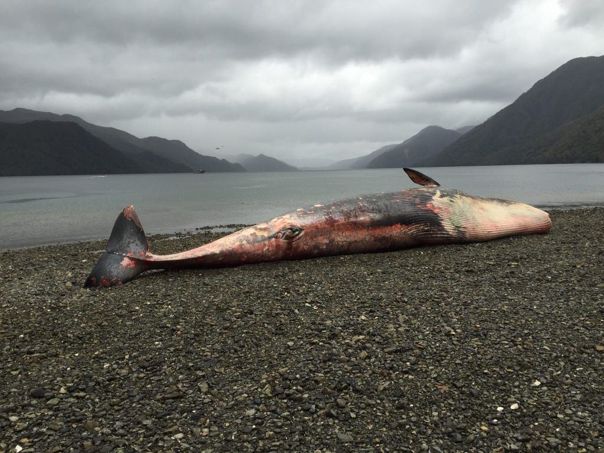
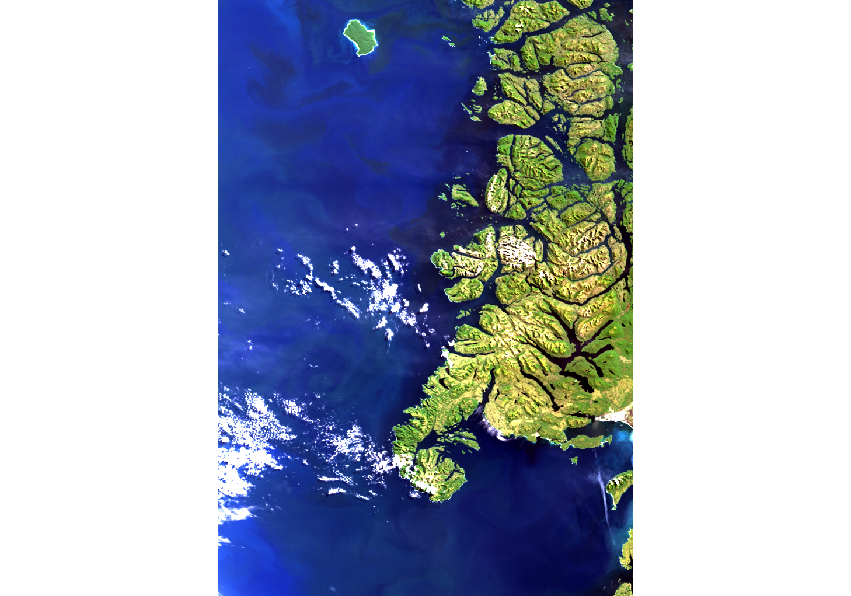

# OceanColor
###  2015, Gulf of Penas (chilean Patagonia), more than 300 whales were found dead. The scene is apocalyptic!

The massive dead was studied in many ways. The whales did not present violence signs. After field, lab and *in-silico* research the event was attributed to **harmful 
algal blooms (HABs)**.

This brief introduction is an example of the importance of applied Ocean Color "techniques". It is an effective way to follow the water quality of vast areas. 
At that time (2015) Sentinel 3 - OLCI (the satellite-sensor used in this repo)  had not been launched but there are other satellite sensors which can works in an effective way
for older dates. 
MODIS in Aqua and Terra or VIIRS in Suomi NPP are good examples. 

Gulf of Penas is located in the south of Chile and is a very complex area. In GIS terms it is difficult to find images without clouds.

### What are you going to find in this repo

This compilation of notebooks and files are not directed to study in detail the massive whales dead. It is a first approach to handle chlorophyll (chl) and total
suspended matter (TSM) data. Also you can find a SNAP (Sentinel Application Platform) guide to process Level 1 products of Copernicus (in this case Sentinel 3) trough 
C2RCC [👉here](https://github.com/grammaloreto/OceanColor/blob/master/snap-level1-c2rcc-process/L1product-chl-tsm.md) 

🐋🐋🐋
