## Copernicus Hub

1. In the [Copernicus Hub](https://scihub.copernicus.eu/]) download a sentinel 3 L1 product. You can specify a polygon (area) of interest, dates or instrument.

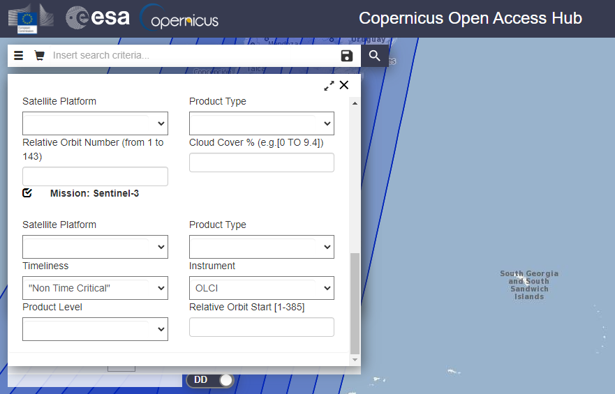

2. The product folder is around 550 and 700 MB.Extract everything from the zip file download.

## SNAP

**If you don't have the SNAP software you can download [here](https://step.esa.int/main/download/snap-download/)**

3. Drag the resulting folder (*step2*) to SNAP software.

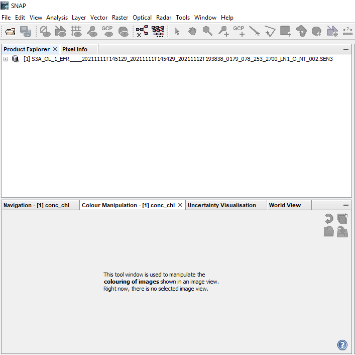

4. Click right button in the file and "Open the RGB Image Window" to visualize the product. For sentinel 3 you can choose bands 8, 6 and 4 respectively.

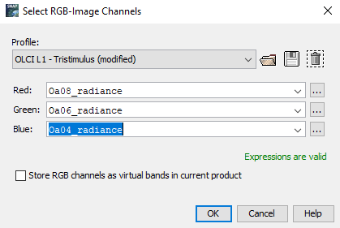

> **It is better to work with subproducts/subsets (pieces of the original file or specific areas) because the manipulation of an entire product can turn time/cost-consuming.**

5. To make a subproduct click Raster (in the toolbar) and then Subset.

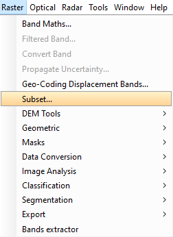

6. It is possible to make: Spatial Subset, Band Subset, Tie-Point Grid Subset or Metadata Subset. 
For example, if you want to havea specific area of syudy in more than one product you chan choose the spatial subset and
the Geo Coordinate option.

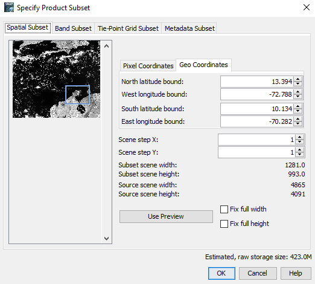

7. After the subset process the product is going to appear in the Product Explorer.

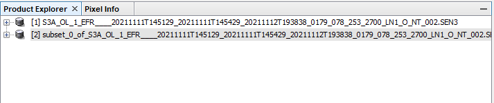

8. You can open the new subset following *step 4*.

9. Example of a **complete product** and a **subset**:

- Complete
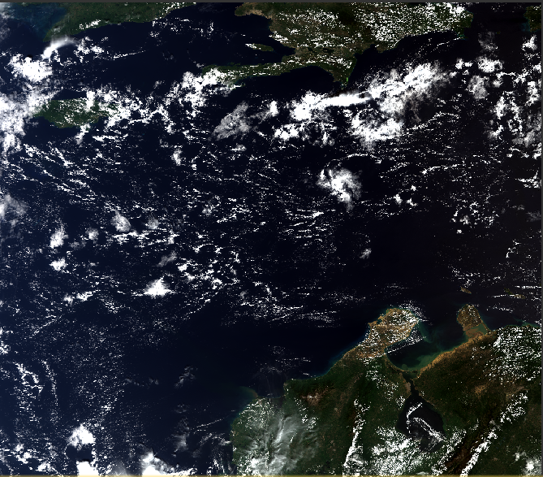

- Subset of the complete product

# OLCI PROCESSOR

10. Select the subset you are going to work with.

11. In the toolbar select Optical. Click the "Thematic Water Processing" then "C2RCC Processors" and then "OLCI".

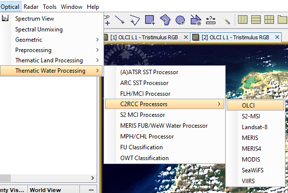

12. After step 11 a window is going to appear. It is important to consider a couple of things:

In **I/O Parameters**:
- confirm that in *OLCI L1b product* is the right subset 
- choose the directory where you are going to save the chlorophyll and tsm subset

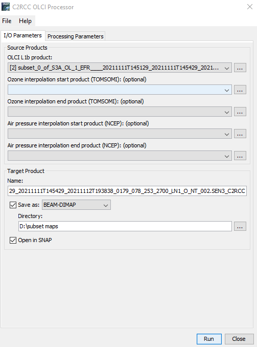

In **Processing Paramets**:
- choose the right Salinity and Temperature of the place where you are working. For example in the Caribbean the mean temperature over the past year was around 28°C and the salinity 35 PSU. In other places the tempetarures are going to drop drastically as well the salinity
- leave the other options by default but remember to be conscius of the physical properties in the area of study.

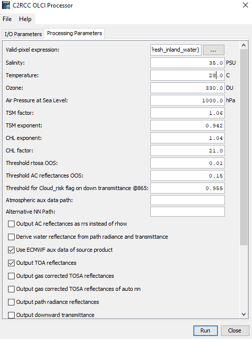

> After these considerations run the model, it is going to take a couple of minutes (it depends of your *in-silico* resources).

## CHL Product

13. After running the model is going to appear another subset in the Product Explorer, in this case is number 3.

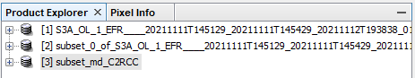

14. Search for **conc_chl** and open it with a double click.

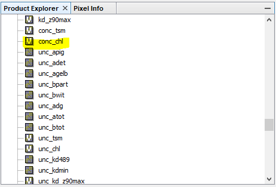

15. It is difficult to recognize a pattern because the image is in black and white but go to the "Color Manipulation" box that is under the Product Explorer. Click in the icon "import colour palette from text file."

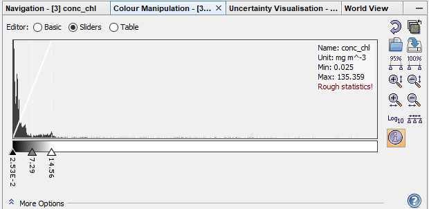

16. In the window choose the palette of your preference. The "cc_chl.cpd" is a good option for chlorophyll(chl).

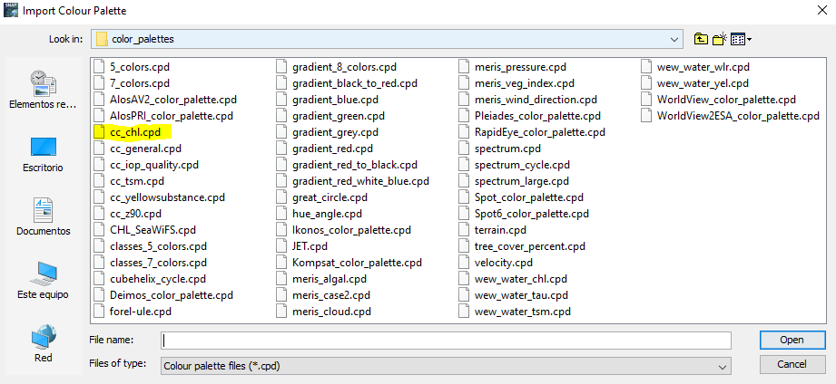

17. The result is an image like this!

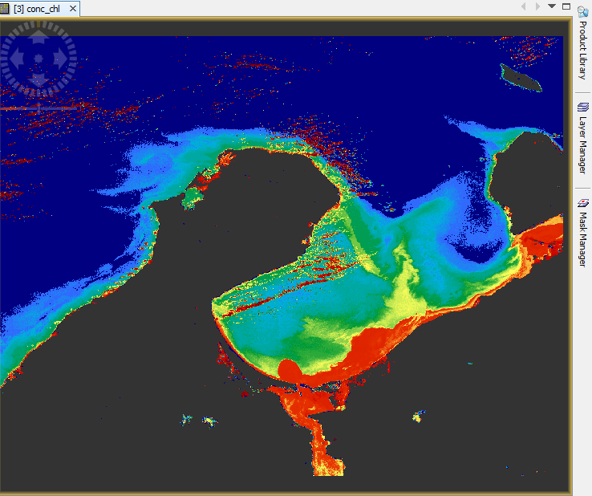

18. It is important to make a **cloud correction**:

- click the "Mask Manager" that is in the right side of the screen (you can see it in the image of *step 17*) and check the "Cloud_risk" option. You can choose other flags for better results. For example, the "quality_flags_land". 

>The resulting new image is with cloud pixels in grey and land in dark green.

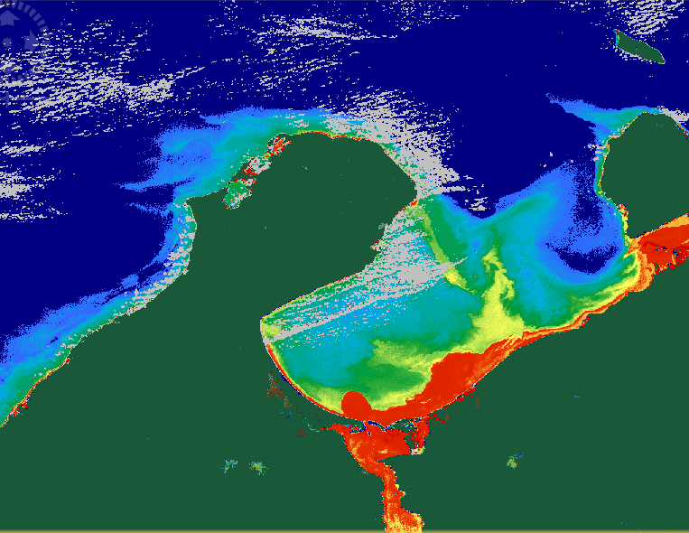

19. To englobe the cloud-corrections make right click in **conc_chl** in the Product Explorer and go to "Properties". 

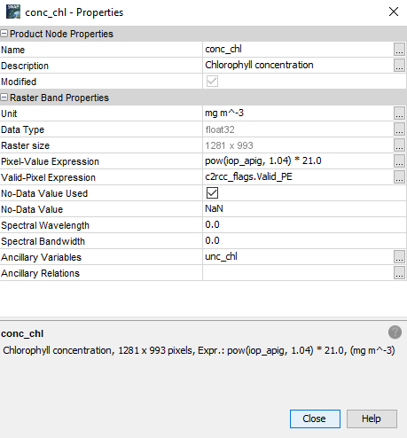

20. Click "Valid-Pixel-Expression". Complete the initial expresion adding: "&& !Cloud Risk"

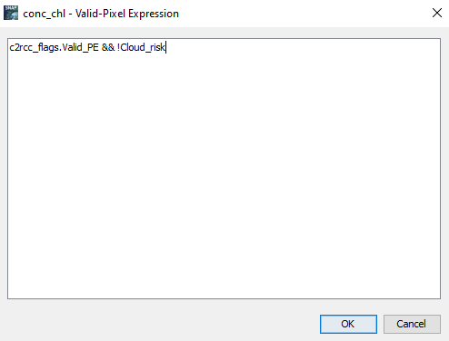

21. Repeat *step 19 and 20* for **unc_chl** in the Product Explorer.

## TSM Product

22. For **tsm product (conc_tsm)** repeat *steps 15-22*.

23. When you choose in the colour palette pick the "cc_tsm.cpd" option (*step 16*).

24. Make the cloud correction and everything else and the resulting image should be like:

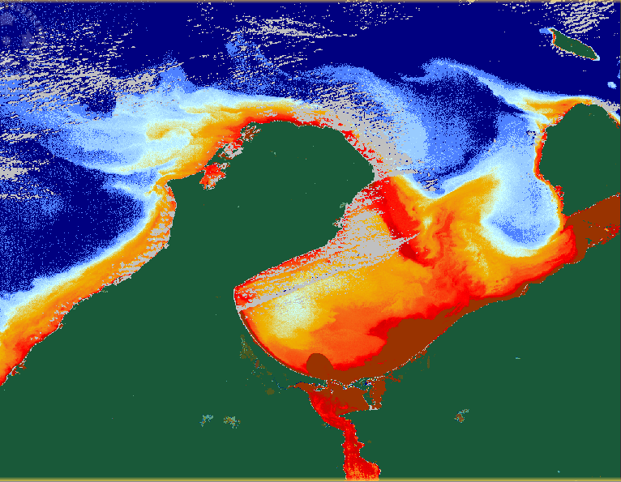

25. Follow *step 21* for the unc_tsm as well.

## Save Products

26. If you completed *steps 13 to 25* make right click in the products you worked (conc_chl, unc_chl, con_tsm, unc_tsm) and choose "Convert Band" for each of the 4 cases.

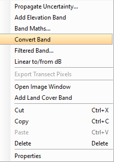

27. Go to the subset where you worked and "Save Product".

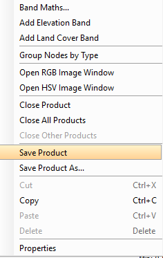

28. Finally you can go to File (in the toolbar) and export the product in the type of your convenience (NetCDF4, GeoTIFF or other).

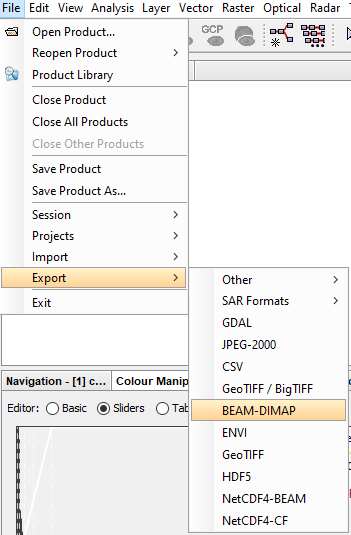

